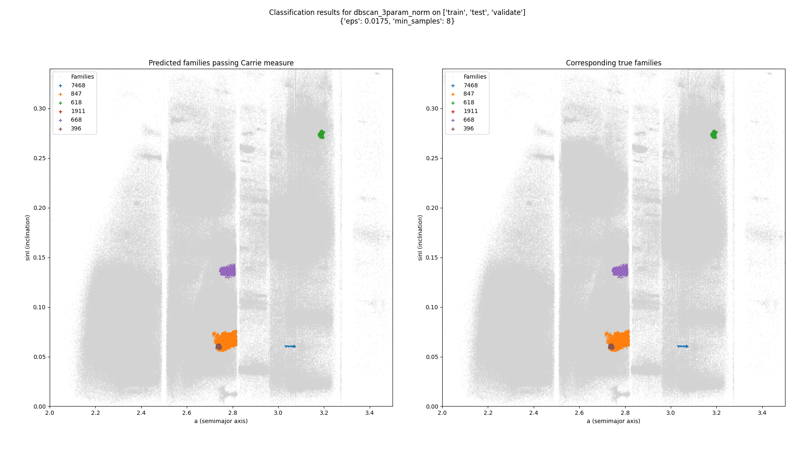
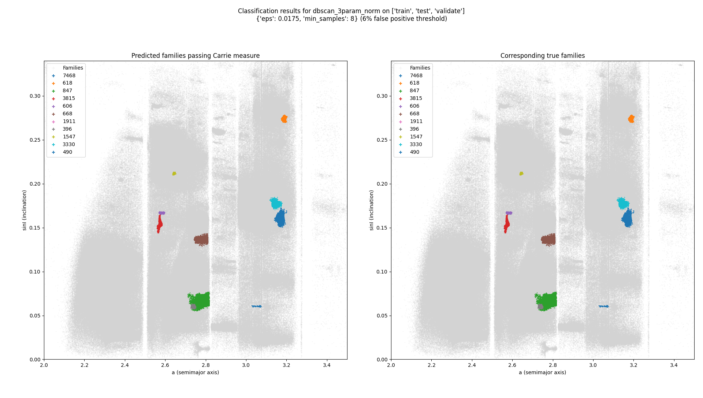
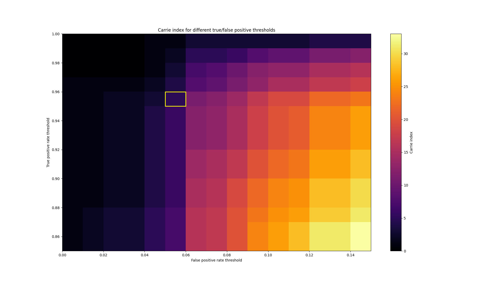
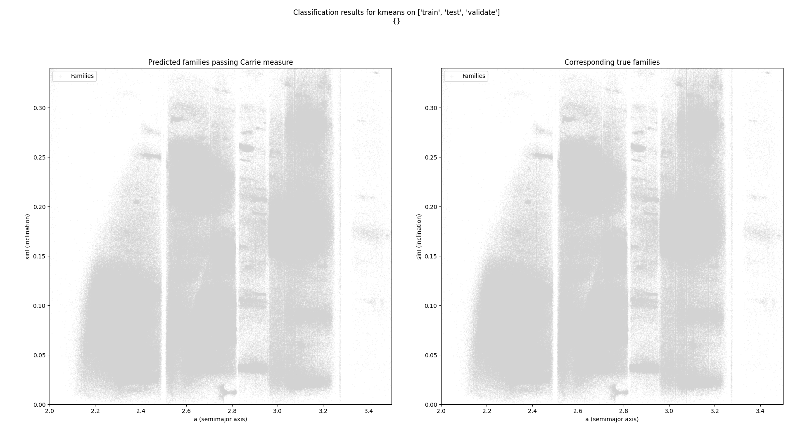
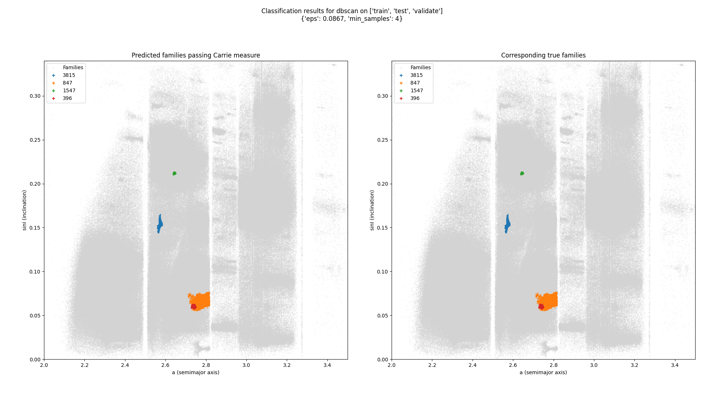
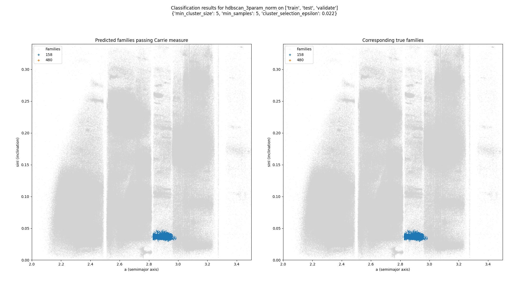

# Asteroid family classification
This project seeks to identify [asteroid families](https://en.wikipedia.org/wiki/Asteroid_family) from raw asteroid orbit data, and to compare the performance of various generalized clustering algorithms on this task. Based on [Groups of Asteroids Probably of Common Origin](https://articles.adsabs.harvard.edu/pdf/1918AJ.....31..185H) by K. Hirayama and the [AstDys database](https://newton.spacedys.com/astdys2/index.php?pc=5) of asteroid information.

## Project structure
This repository is constructed as a series of steps that are intended to be run roughly in sequence. The actual function of each step is documented below, but in essence, the steps download raw data, partition it, run one or more clustering algorithms on it, and plot the results of those clusters.

### Directories
- `common`: Code used by multiple steps, like classifiers, or user interfaces
- `data`: The raw data that the program operates on
- `data/sweeps`: The results of parameter sweeps
- `results`: Graphs and data moved here by the author, used in documentation. No code uses this directory.
- `steps`: Python scripts that are intended to be run by the user in sequence, in service of creating final results.
- `tests`: Pytest tests for components of the system that use Pytest (see below for commentary on testing/correctness)

## Benchmark comparison
The benchmark for this project is a Carrie measure of at least 8 (see [Metrics](#metrics) for an explanation of the Carrie measure). The best result this project was able to achieve was a Carrie measure of 6, shown below:

(Family 1911 is the Schubart family, a group of Hildian asteroids outside of the main asteroid belt with a large semimajor axis of ~3.96 AU. It is off the right side of the plot.)

These results were achieved using the DBSCAN algorithm, running on the 3-parameter normalized dataset, with an `eps` parameter of 0.0175 and a `min_samples` parameter of 8. However, the results are very sensitive to changes in permissiveness of the Carrie measure. For example, if the false positive threshold is increased just from 5% to 6%, the Carrie measure jumps from 6 to 11:

And here's a general sensitivity plot of how the Carrie measure changes as the true positive threshold and false positive threshold are adjusted:

Finally, here are the best results of 4 tested classifiers side-by-side:

| K-means (Carrie measure: 0) | DBSCAN (Carrie measure: 4) | 
|---|---|
| | |
| DBSCAN/3-param/norm (Carrie measure: 6) | HDBSCAN/3-param/norm (Carrie measure: 2) |
| |  |

## Usage
### (with `uv`)
[`uv`](https://docs.astral.sh/uv/) is an incredible Python package manager. If you have it installed, simply run `uv run python main.py` and the program will launch with all dependencies being automatically installed.

### (without `uv`)
If you don't have `uv` installed and don't want to use it:

0. Make sure you have at least Python 3.13.
1. Set up a venv to install dependencies into.
2. `pip install -r requirements.txt`
3. `python main.py`

Once you have the program running, you will be provided a list of steps to run. See below for what each step does.

You will often be offered a choice of classifiers or datasets. The various options for these are discussed below.

## Steps

### 00: Download data
Downloads raw orbital elements and family membership data from [AstDys](https://newton.spacedys.com/astdys2/index.php?pc=5), and stores it in `./data`. 

Run this once, upon first cloning the repository.

### 01: Import and partition data
Takes the downloaded orbital elements and splits them into train, test, and verification datasets, and store the result in `./data`.

Run this once, after running step 00.

### 10: Single cluster
Run a single clustering algorithm on a single dataset, and show the results in the console.

This has been superseded by step 12, which also plots the results.

### 12: Single cluster and plot
Run a single clustering algorithm on one or more datasets, and plot the results.

Plots both a visualization of the asteroid families found in a-i space, and a comparison of how adjusting the thresholds for true and false positives would change how many asteroids are found (see below for discussion on how these metrics work).

Run this to produce nice visualizations of clustering results, or to see how changing accuracy strictness would change results.

### 20: Parameter sweep
Run a single clustering algorithm at a variety of parameter values, to find which parameter values work best.
The syntax for entering a parameter range is `param_min:param_max:step`.
An output CSV will be generated in `data/sweeps`, with the format `<classifier>_<dataset>_<param=value>*_results.csv`

This step supports input via the command line, and is generally intended to be parallelized on the Unity supercomputer via the `slurm-array-param-sweep.sh` script.
To use that script, adjust the core/memory/time allocations per job (line 2, 4, 6), the array task IDs to use (line 8), the parameter step per run and per job (lines 12 and 13), and the algorithms and parameters in use (line 18). Then, on Unity (or some other Slurm-using HPC cluster), run `sbatch slurm-array-param-sweep.sh` and wait for the results.

Run this when you want to find what the ideal parameter values are for a certain algorithm, and when you have a few hours to spare.

### 21: Concatenate sweep results
Take the many files generated as a result of a parallelized parameter sweep and put them into a single CSV file for easy analysis.

Run this after running a parallelized parameter sweep with step 20.

### 25: Plot sweep results
Take a concatenated sweep result file and plot its metrics.

Plots one or two parameters against the 4 metrics: number of families found, number of non-family asteroids, [V-measure], and Carrie measure. See below for in-depth explanation of these metrics.

Run this once you have a concatenated results file from step 21.

## Metrics
Classifiers are evaluated on 4 metrics. In order of most to least important:
### Carrie measure
The Carrie measure is the number of families that have a true positive rate of at least 95% and a false positive rate of at most 5% (by default). This means that, for a family to count in the Carrie measure, its predicted members must include at least 95% of the true members, and at most 5% of the predicted members can be non-members. This is the most important metric, as the benchmark for the project is a Carrie measure of at least 8. Slight changes in the criteria for the Carrie measure can lead to significant changes in the score, and the effects of these changes can be explored by running step 12.
### V-measure
The V-measure is a standard metric for evaluating the accuracy of clustering algorithms. It is the harmonic mean of homogeneity and completeness, where homogeneity measures how many members of a predicted family are in the same true family, and completeness measures how many members of a true family are in the same predicted family. It is not directly evaluated, but is useful because it is more continuous over parameter space than the Carrie measure is, which helps in evaluating the performance of a classifier even when it doesn't meet the fairly strict criteria of the Carrie measure.
### Number of families found
The number of families found is simply the number of clusters identified by the classifier. For some reason, this is almost always much higher than the actual number of families in a dataset. This is occasionally useful to help with tuning parameters closer to the real number of families.
### Number of non-family asteroids
The number of non-family asteroids is the count of asteroids that the classifier does not assign to any family. This is occasionally useful as a sanity check, but it is not broadly tuned for. 
## Classifiers
There are three base classifiers implemented, some of which have variants with additional preprocessing steps. The classifiers are:
- K-means: A standard clustering algorithm that, while fast, is a poor fit for this problem, as it requires a given number of clusters and cannot reject outliers. Implemented as a baseline, but not expected to perform well.
- DBSCAN: A density-based clustering algorithm that can reject outliers, but requires tuning of the `eps` and `min_samples` parameters. The `eps` parameter is the maximum distance between two samples for them to be considered as in the same neighborhood, and the `min_samples` parameter is the number of samples in a neighborhood for a point to be considered as a core point.
- HDBSCAN: A hierarchical density-based clustering algorithm that can reject outliers and does not require a given number of clusters, but requires tuning of the `min_cluster_size` parameter, and the `cluster_selection_epsilon` parameter. The `min_cluster_size` parameter is the minimum size of clusters, and the `cluster_selection_epsilon` parameter is the distance threshold for merging nearby clusters together.

By default, classifiers are given all 6 elements: a (semi-major axis), e (eccentricity), sinI (sine of inclination), n (mean motion), g (longitude of perihelion), and s (longitude of ascending node). Classifiers labelled with `3param` instead only receive a, e, and sinI, and usually perform better. Finally, classifiers labelled with `norm` have their input data normalized to similar scales, which also usually improves performance.

## Datasets
The full datasets were split into train, test, and validate sets. Ultimately, these were not needed for their original purpose, but the classifiers perform better when they are run on smaller datasets, so they were kept. 

This split was nontrivial. To make sure that a single family was not split across multiple datasets, the list of families was first randomly split into three groups. Then, all asteroids belonging to a family were put in their corresponding dataset. Finally, the non-family asteroids were randomly split across the three datasets.

## Testing and Correctness
Testing for this project is complicated. For the classifiers themselves, the ultimate measure of correctness is how well they perform on the metrics described above. For this reason, formal unit tests focus on making sure that metric calculation accurately compares proposed families to the ground truth. Additionally, in some steps (like `01_import_and_partition_data.py`), assertions are used to make sure that the data is being processed correctly. 
